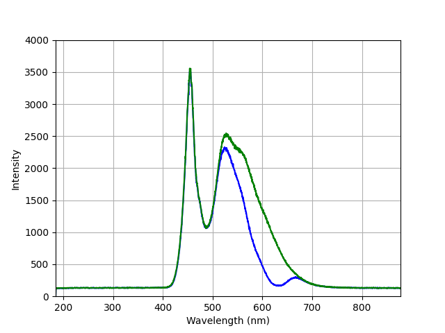
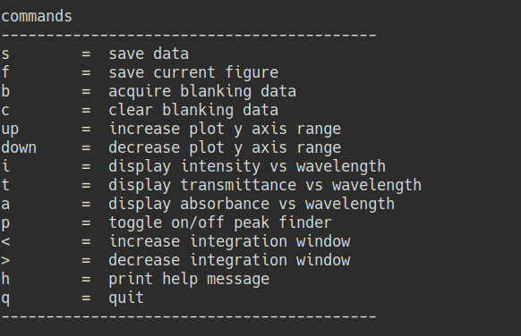
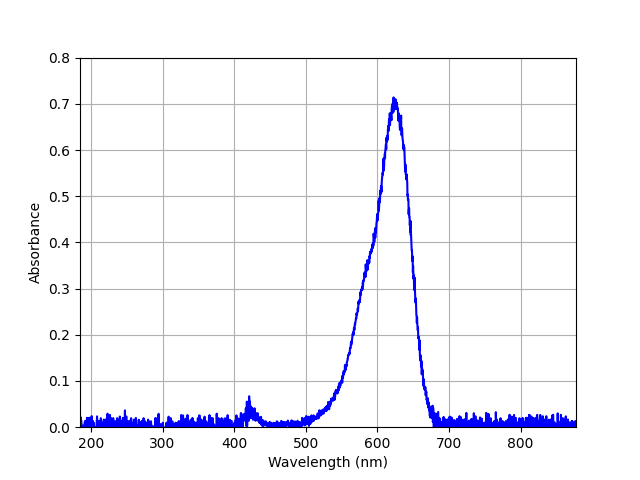
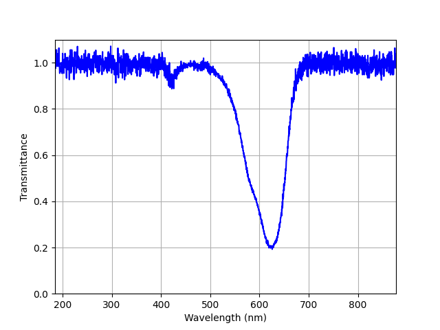
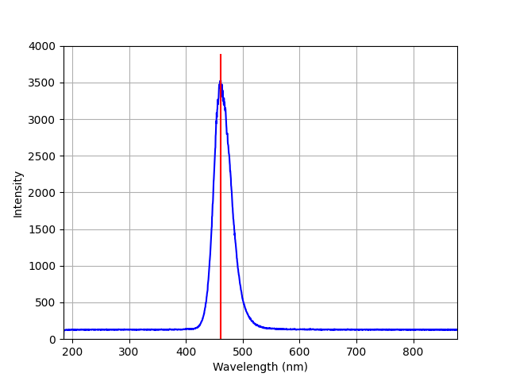

##  sb_live_view 

A simple live viewer for Ocean Optics spectrometers using the Python SeaBreeze
library.  

Includes the following capabilites:

* display a live view of the light intensity vs wavelength
* capture blanking/reference intensities
* capture and display sample transmittance and absorbance.  
* find peak absorbance, intensity and minimum transmittance

Requires:

* numpy
* matplotlib
* seabreeze https://github.com/ap--/python-seabreeze

